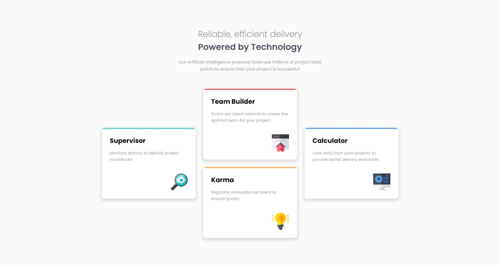
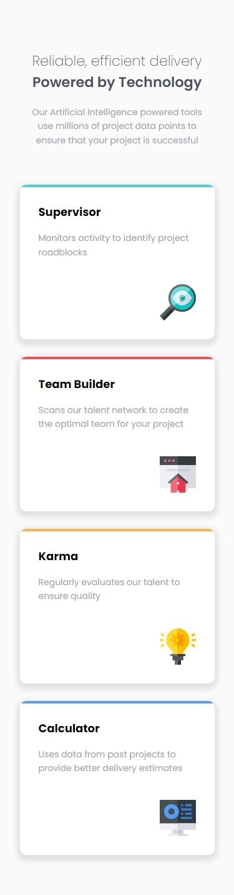

# Frontend Mentor - Four card feature section solution

This is a solution to the [Four card feature section challenge on Frontend Mentor](https://www.frontendmentor.io/challenges/four-card-feature-section-weK1eFYK). Frontend Mentor challenges help you improve your coding skills by building realistic projects. 

 ## Table of contents

- [Overview](#overview)
  - [Screenshot](#screenshot)
  - [Links](#links)
- [My process](#my-process)
  - [Built with](#built-with)
  - [What I learned](#what-i-learned)
  - [Continued development](#continued-development)
  - [Useful resources](#useful-resources)
- [Author](#author)
- [Acknowledgments](#acknowledgments)

## Overview

### The challenge

Users should be able to:

- View the optimal layout for the site depending on their device's screen size

### Screenshot

Desktop Screenshot

Mobile Screenshot  

### Links

- Solution URL: [Github](https://github.com/adewalemudasiru/Four-card-feature-section-solution)
- Live Site URL: [SolutionPreview](https://adewalemudasiru.github.io/Four-card-feature-section-solution/)

## My process

Created two divs and placed them in the body. The first div is used for the heading and the second for the content. I then used use CSS drid to arrange the content box the correct position.

### Built with

- Semantic HTML5 markup
- CSS custom properties
- Flexbox
- CSS Grid
- Mobile-first workflow

### What I learned

I learned a new way to use CSS grid and got a better understanding of the positioning properties.

### Continued development

This challenge made a joke of me. I learnt I still have a long way to go in styling with CSS especially using the flex box and grid properties. I'm going to put more effort into those aspects. 

## Author

- Website - [Adewale Mudasiru](https://github.com/adewalemudasiru)
- Frontend Mentor - [@adewalemudasiru](https://www.frontendmentor.io/profile/adewalemudasiru)
- Twitter - [@ade_mudasiru](https://www.twitter.com/ade_mudasiru)

## Acknowledgments

Thanks to Claude AI and ChatGPT for helping me better some concepts in CSS. I used them a lot when I get confused on how to go about some of the things in html and css and their implementation.
